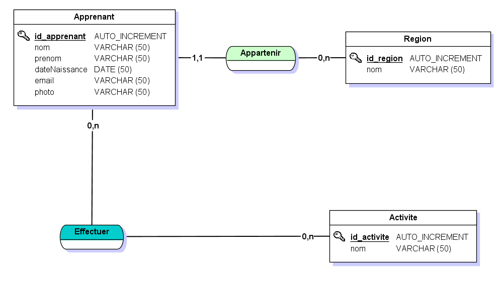
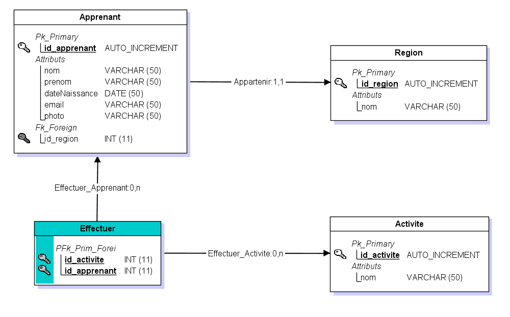

# Evaluation Session 2

## mise en place projet.

  fork dépôt solution jdbc (modele mvc).
  
  création du diagramme de classe.
  
  méthode agile avec decoupage des taches.
  
  travail collaboratif Gorce Pierre, Joblon Samuel.
  
## 1ere journée.
  
  mcd, mld et merise crée par SJ.
  
  création du fichier .sql pour implementer la base de données sql par SJ.
  
  1er code review: step by step création sur jmerise du mcd, mld et .sql sur Jmerise.
  
  
  
   
  mise en place du schema db_Apprenant avec les tables et les columns avec utilisation de Workbench.
   
  refactoring du fork avec création des classes par PG.
  
  fin de journée, réalisation du 1er Read sur db_apprenants par PG.
  
  ## 2eme journée.
  
  mise en place du Create, Read, Update, Delete.
  
  2eme code review: Crud.
  
  mise en place de la db definitive
  
  creation requete pour ajouter apprenant et modifier nom par SJ.
  
  creation de la requete qui prend en parametre l' id region  retourner le nom de la region par PG.
  
  ###### pair programming
  
  mise en place de la methode qui retourne le nom et le prenom en utilisant la methode qui catch tous les apprenants. SJ & PG
  
          -----------------------------------------------------------------------------------------
  
  création de la methode pour afficher les activités non pratiquées. PG
  
  création de la méthode ajouter deux activités avec un apprenant en pramètre. PG
   
  création afficher une liste d'apprenants avec une activité en paramètre. SJ
  
  création afficher la liste des activités avec un apprenant en paramètre. SJ 
  
  
